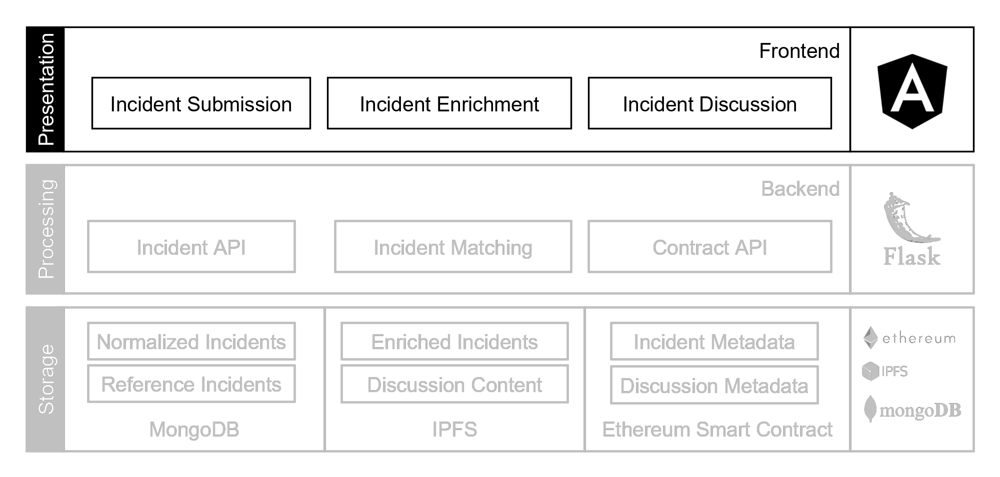

# BISCUIT Frontend

*This repository is part of a research project on blockchain security incident reporting based on human observations. The research paper is currently under review.*

Security incidents in blockchain-based systems are frequent nowadays, which calls for more structured efforts in incident reporting and response. To improve the current status quo of reporting incidents on blogs and social media, we propose a decentralized incident reporting and discussion system.
This repository implements the associated frontend, which provides the user interface for reporting new incidents and discussing them. It also gives admins the possibility to accept or reject reported incidents in order to have control over the information that leaves an organization.

The following image highlights the app layers and architecture:



## Docker
You can run the entire project with docker-compose located in the backend repository: [https://github.com/biscuitsecurity/Backend](https://github.com/biscuitsecurity/Backend)

## Project setup


The frontend requires a running [backend](https://github.com/biscuitsecurity/Backend). The URL to the backend can be adjusted in /src/environments/environment.ts.

To run the frontend by itself for debugging, first install all node dependencies with
```
npm install
```

Then the project can be started with a development web server listening on localhost:4200
```
ng serve
```
